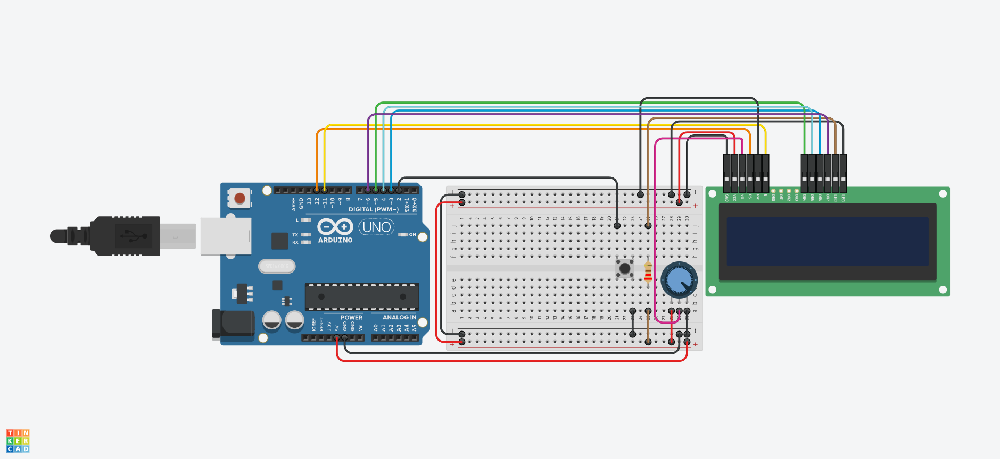

# Micro-Contrladores
Aividade de avaliação da N2

Projeto de criação de um pequeno game na plataforma ThinkerCAD utilizando arduino:

## Lista de Componentes

| Nome    | Quantidade | Componente           | Link                                   |
|---------|------------|----------------------|----------------------------------------|
| U1      | 1          | Arduino Uno R3       | [Arduino Uno](https://www.arduino.cc/) |
| U2      | 1          | LCD 16 x 2           | [LCD 16x2](https://www.adafruit.com/)  |
| Rpot1   | 1          | 250 kΩ Potenciômetro | [Potenciômetro](https://www.amazon.com.br/) |
| R1      | 1          | 220 Ω Resistor       | [Resistor](https://www.amazon.com.br/) |
| S1      | 1          | Botão                | [Botão](https://www.adafruit.com/)     |

## Visão Esquemática

Abaixo visão do esquema de ligação dos compenentes:  

Acesso a codificação

Acesso ao projeto no ThinkerCAD: [Projeto N2](https://www.tinkercad.com/things/bReYzSNEFTT-micro-elico-n2/editel?returnTo=https%3A%2F%2Fwww.tinkercad.com%2Fdashboard%2Fdesigns%2Fcircuits&sharecode=Vp_gmCmpb14rObY9lTz21X7dx6KztV8tlNRaED8rZI8)

